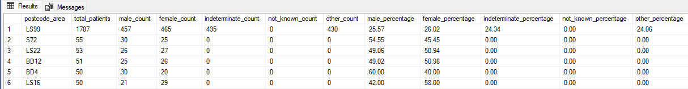

# Asthma Research Cohort Analysis

SQL solution for selecting eligible patients for an asthma research study based on clinical data.

## Project Overview

This project analyses healthcare data to identify patients suitable for an asthma research study. The analysis focuses on selecting patients who meet specific clinical criteria while ensuring appropriate gender distribution.

## Data Sources

- `patient.csv`
- `observation.csv` (combined from 12 files)
- `medication.csv` (combined from 15 files)
- `clinical_codes.csv`

## Steps

1. **Install and set up Microsoft SQL Server 2019 Express** and Microsoft SQL Server Management Studio for data and database management. This combination was chosen because:
   - SQL Server Express is free and provides sufficient capabilities for this analysis
   - Often used for healthcare data due to robust security
   - SSMS offers a user-friendly interface for data exploration and querying

2. **Create database and tables**
   - Structured raw data into 4 main tables: `patient`, `observation`, `medication`, and `clinical_codes`
   - Created cleaned versions of these tables: `observation_clean`, `medication_clean`, and `clinical_codes_clean`, removing rows with NULL keys and de-duplicating clinical codes using `ROW_NUMBER()`.

3. **Load data** using one of these methods:

> **_NOTE:_**: For multiple .csv files, CLI `copy` commands were used first to combine them into one file

   - SQL Server Import Wizard
   - BULK INSERT: Alternative for handling large datasets
   - CLI commands

4. **Explore data**
   - Previewed top rows of each table.
   - Checked for NULLs and duplicates.
 
5. **Data preparation**:
   - Created cleaned versions of these tables: `observation_clean`, `medication_clean`, and `clinical_codes_clean`, removing NULLs from key columns while preserving other fields and de-duplicated clinical codes using `ROW_NUMBER()`.
   - Added Primary Keys and Foreign Keys

6. **Part 1: Patient Distribution Analysis**:
   - Analysed patient distribution by postcode area and gender
   - Combined "Not Known" and `NULL` genders under a `unknown` category.
   - Calculated percentages of male, female, undetermined and unknown patients in each area
   - Ordered by `total_patients` descending to identify post codes with the largest population of patients

7. **Part 2: Patient Selection**:
   - Selected only living patients in the top 2 post codes from Part 1
   - Applied inclusion criteria:
     - Asthma diagnosis (`refset 999012891000230104`)
     - Prescribed specific medications by EMIS code or SNOMED concept ID within the last 30 years 
   - Applied exclusion criteria:
     - Current smoker status (`refset 999004211000230104`)
     - Weight below 40kg (`snomed_concept_id = 27113001`)
     - COPD diagnosis (`refset 999011571000230107`)
     - Research opt-outs 
   - Generated final patient list with full demographic informatio

    Date filtering done with:

    ```sql
    TRY_CONVERT(DATE, m.effective_date) >= DATEADD(YEAR, -30, GETDATE())
    ```

    This handles non-standard formats.

## Testing Approach

- Each cleaned table (`_clean`) was validated using `SELECT COUNT(*)`, `IS NULL`, and `GROUP BY` to check for missing or duplicate key values
- Eligibility criteria application was tested step-by-step:
  - First filtered for postcode
  - Then tested asthma diagnosis alone
  - Then applied one exclusion at a time
- Used `TOP 10` previews and manual record reviews (e.g., by `registration_guid`) to validate results
- Manually cross-referenced EMIS codes against official SNOMED list to verify medication mappings


## Technical Highlights

- Created cleaned data tables using `SELECT INTO`, `ROW_NUMBER()`, and `DROP COLUMN` techniques.
- Used Common Table Expressions (CTEs) and subqueries.
- Used SQL Server functions like `FORMAT`, `CHARINDEX`, `DATEADD`, and `TRY_CONVERT` to handle strings, dates, and percentages appropriately.
- Used a step-by-step modular  approach for filtering, for easier debugging and reuse without having to rewrite the whole query.

## Key Findings

- LS99 and S72 are the postcode areas with highest patient counts.
- Many patients have asthma diagnoses (398)
- Large number of patients (982) are smokers so were excluded
- When applying the medication filter, 0 patients were returned as elligible. Swapped with other post codes, but it returned the same outcome. Cross-referenced the clinical coding data on the official SNOMED site.

Postcodes with highest patient counts:




## Fixes, Technical Challenges

-  Resolved duplicate `code_id`s using `ROW_NUMBER()` partitioning and removed `rn`, however when attempting to add a Foreign Key on `emis_code_id` it did not work due to 2,664 unmatched values in clinical codes.
- `medication_valid` view was initially created to enforce foreign key integrity, but excluded too many valid rows, so  reverted to using `medication_clean`, which preserved useful data.
- The `parent_code_id` condition had no effect on the current results but was kept in the query to allow for future data updates.

## Future Improvements

- Implement indexing on key columns to enhance query performance and ensure scalability as the dataset grows.
- Automate data loading or report generation (e.g by using Aitflow DAGs).
- Review the criteria for eligibility.
- Enrich the dataset with additional clinical data sources (e.g. allergy history, long-term conditions, hospital admissions) to improve cohort representativeness.
- Expand the geographical scope beyond 1–2 postcode areas to avoid sampling bias.
- Review which columns are needed and which are unnecessary and adjust the scripts for creating cleaned data tables.
- VARCHAR type was used across all columns to allow easy loading of the .csv files for  early-stage exploration in this case. However a standardisation step could be added to the script to improve usability for future users and ensure consistency in data types. This is noted in data_analysis.sql in the meantime.